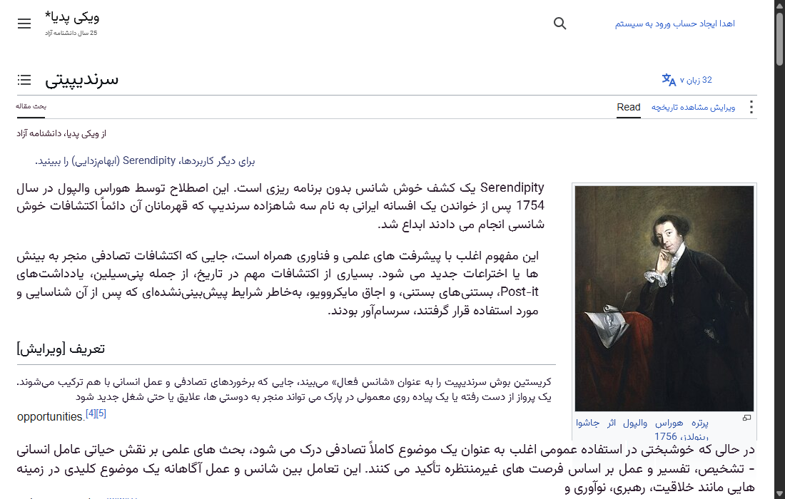
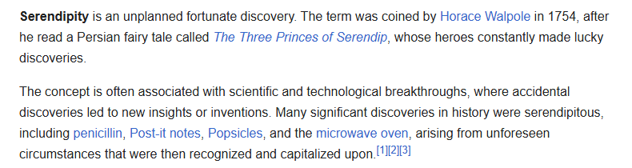
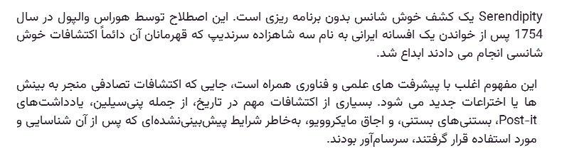
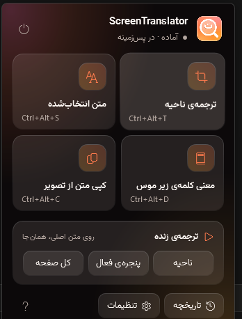
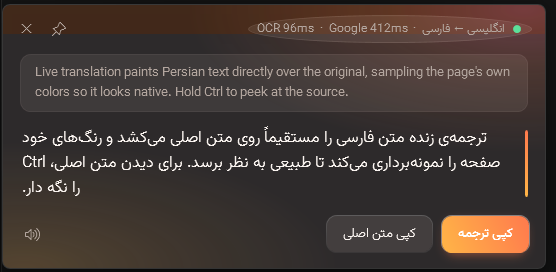
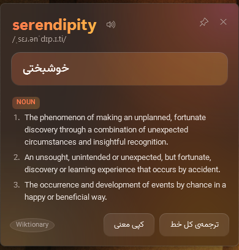
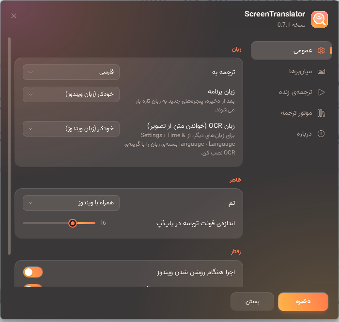

<div align="center">


# ScreenTranslator

**“Circle to Search” for Windows.** Read any text on your screen with a shortcut — or translate a region **live**, so the page looks like it was written in your language from the start.

[](LICENSE)
[](#install)
[](#build-from-source)
[](https://github.com/MSJR110/ScreenTranslator/releases/latest)

[فارسی](README.fa.md) · [Download](https://github.com/MSJR110/ScreenTranslator/releases/latest) · [Shortcuts](#shortcuts) · [Build](#build-from-source)



</div>

---

## What it does

Press a shortcut, drag over anything on screen — a video, a PDF, a game, an image, a dialog box — and the text comes back translated. No copy-paste, no browser tab, no main window: it lives in the tray and wakes up on a hotkey.

**Live mode** is the interesting one. It keeps reading a region (or a whole window) 1–2× per second and paints the translation *on top of* the original: it samples the page's own colors, background texture, and font weight, so the result reads as native text rather than an overlay. Scroll, click, keep working — the boxes follow along. Hold `Ctrl` to peek at the source.

| Original | Live translation |
|---|---|
|  |  |

## Features

- **Offline OCR** — Windows' built-in engine. No GPU, no upload, ~100 ms for a full screen. Small fonts are upscaled automatically.
- **Free translation out of the box** — Google, no API key required. Optionally plug in an AI engine (Claude, or any OpenAI-compatible endpoint) with automatic fallback to Google.
- **Word lookup** — point at a word, press a key: IPA pronunciation, natural audio, the meaning in your language, and English definitions from Wiktionary. All free, no keys.
- **Selected-text mode** — translate what you've highlighted in any app without OCR at all (the most accurate path).
- **OCR to clipboard** — grab text out of an image or a video frame without translating it.
- **11 target languages** — Persian (default), English, Arabic, Turkish, German, French, Spanish, Russian, Italian, Japanese, Chinese.
- **Windows 11 look** — acrylic surfaces, rounded corners, dark/light following the system, per-monitor DPI, multi-monitor aware.
- **Light** — 0% CPU when idle, ~10 MB RAM, single ~34 MB executable, no background services.
- **Private by default** — history stays on your machine, API keys are encrypted with DPAPI, nothing is sent anywhere except the translation request itself.

> **Note on language:** the app's own interface is in Persian (the project started as an English → Persian reading tool), while the *target* language of translation is configurable. Contributions that add UI localization are very welcome.

## Shortcuts

All of them are rebindable in Settings → Shortcuts.

| Default | Action |
|---|---|
| `Ctrl+Alt+T` | Drag a region → popup with the original text and its translation |
| `Ctrl+Alt+S` | Translate the text selected in any app (no OCR — the most accurate mode) |
| `Ctrl+Alt+D` | **Define the word under the cursor** — IPA, audio, meaning, Wiktionary definitions |
| `Ctrl+Alt+C` | Drag a region → its text goes to the clipboard untranslated (pure OCR) |
| `Ctrl+Alt+L` | Live-translate a region — press again to stop |
| `Ctrl+Alt+W` | Live-translate the active window (follows it as it moves) |
| Hold `Ctrl` | In live mode, temporarily reveal the original text |
| `Esc` | Close the popup / cancel a selection |
| Drag popup edge | Resize (remembered); double-click the header to auto-fit |

Clicking the tray icon opens a glass flyout with the four main actions, live mode (region / window / full screen), history, settings, and the getting-started guide.

<div align="center">


</div>

<div align="center">


</div>

## Install

Grab the latest build from the [Releases page](https://github.com/MSJR110/ScreenTranslator/releases/latest):

- **Setup** — `ScreenTranslator-Setup-<ver>.exe`. Installs for the current user (no UAC prompt), with an option to start with Windows.
- **Portable** — `ScreenTranslator-<ver>-portable.zip`. Unzip and run.

Requirements: Windows 10 version 2004 or newer (x64) and the [.NET 10 Desktop Runtime](https://dotnet.microsoft.com/download/dotnet/10.0) — the installer links to it if it's missing. For a build with the runtime bundled in, see `publish.ps1 -SelfContained` below.

The executable is not code-signed (certificates cost more than this project does), so SmartScreen will warn on first run — *More info* → *Run anyway*.

## Build from source

```powershell
.\publish.ps1 -Zip -Installer     # -> dist\ and installer\Output\
.\publish.ps1 -Run                # just build the exe and run it
.\publish.ps1 -SelfContained      # bundle the .NET runtime
.\tools\make-icon.ps1             # regenerate Assets\app.ico and logo.png
```

Requirements: the .NET 10 SDK, plus Inno Setup 6 (`winget install JRSoftware.InnoSetup`) if you want the installer.

## Architecture

```
src/ScreenTranslator/
├─ App.xaml.cs               orchestration: hotkey → capture → OCR → translate → UI; history, settings, welcome
├─ App.Debug.cs              --selftest / --demo-* : hands-off screenshots of every window
├─ Services/
│  ├─ OcrService             Windows.Media.Ocr + automatic upscaling for small fonts
│  ├─ TextLayout             OCR lines → paragraphs/blocks; rejoins broken lines; drops untranslatable text
│  ├─ LiveSession            the live loop: capture → change detection → OCR → batched translation → sampling
│  ├─ RegionPixels           reads a region's pixels: ink/background color, stroke weight (bold), texture, surface edges
│  ├─ Translation/           Google (two endpoints), Claude (official SDK), OpenAI-compatible, fallback, cache, factory
│  ├─ Hotkey / HotkeyManager configurable global shortcuts
│  ├─ HistoryStore           JSON history (500 entries)
│  ├─ SecretStore            API keys encrypted with DPAPI
│  ├─ SelectionReader        synthesized Ctrl+C with clipboard restore
│  ├─ SpeechService          Google's online voice for short text, Windows voices otherwise
│  └─ DictionaryService      Wiktionary REST (definitions, examples) + wikitext (IPA); resolves inflected forms
├─ UI/
│  ├─ OverlayWindow          click-through, capture-excluded layer; translated text over the original
│  ├─ LivePillWindow         floating control for live mode
│  ├─ ResultWindow           translation popup (acrylic, resizable)
│  ├─ WordWindow             single-word dictionary card
│  ├─ ToastWindow            small HUD for feedback (copied, error…)
│  ├─ HighlightWindow        brief flash around the picked word
│  ├─ SettingsWindow         settings (general, shortcuts, live, engine, about)
│  ├─ HistoryWindow / WelcomeWindow / RegionSelectorWindow (one per monitor)
│  ├─ Controls.xaml          control styles (toggle, slider, combo, scrollbar, input)
│  └─ Theme / Dpi / HotkeyBox / AppIcon
└─ Native/                   RegisterHotKey, SetWindowDisplayAffinity, DWM backdrop, per-monitor DPI
```

### Why it stays light

- Live mode captures 1–2× per second and only runs OCR when the frame hash actually changed.
- Translations are cached, and new blocks go out in a **single** request.
- The overlay is hidden from capture with `WDA_EXCLUDEFROMCAPTURE`, so the app never reads its own output back.

### Working on the UI

Every window can be screenshotted without touching the mouse:

```powershell
.\dist\ScreenTranslator.exe --demo-popup shot.png
.\dist\ScreenTranslator.exe --demo-settings shot.png live
.\dist\ScreenTranslator.exe --demo-live-file page.png out.png   # run the whole live pipeline over a PNG
```

`--demo-popup|settings|history|welcome|word|lookup|selector|toast|tray|live|live-file` are all supported; `ST_THEME=light|dark` overrides the theme.

## Privacy

- OCR runs locally, on your machine.
- Only the recognized text is sent to the translation service you picked (Google by default, or your own AI endpoint).
- History is a JSON file in your user profile and can be turned off; API keys are encrypted with Windows DPAPI.
- The app has no telemetry, no analytics, and no update pings.

## Contributing

Issues and pull requests are welcome — especially UI localization, extra OCR languages, and reports of sites or apps where the live overlay misbehaves. The codebase is plain WPF with no MVVM framework; each window is a small self-contained file.

## License

[MIT](LICENSE).

The bundled Vazirmatn font is licensed under the [SIL Open Font License 1.1](src/ScreenTranslator/Assets/Fonts/LICENSE-Vazirmatn.txt).
